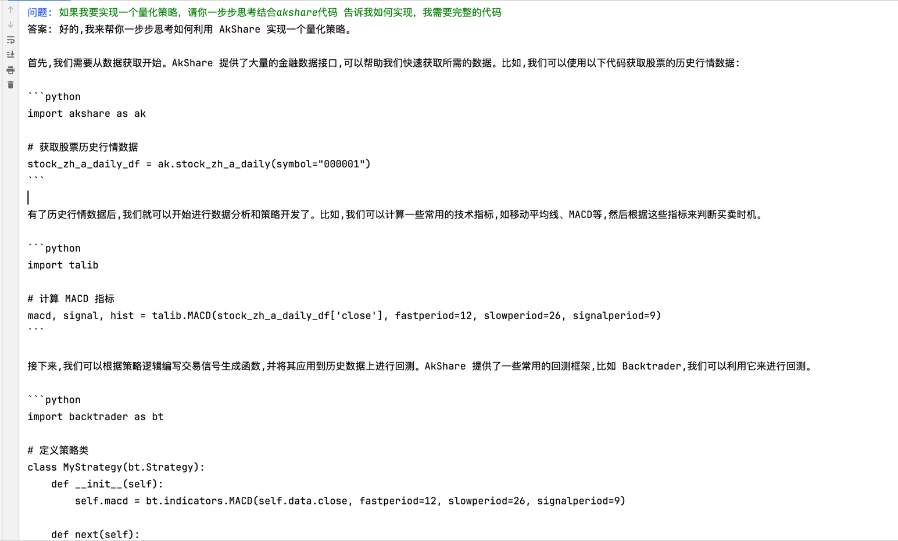
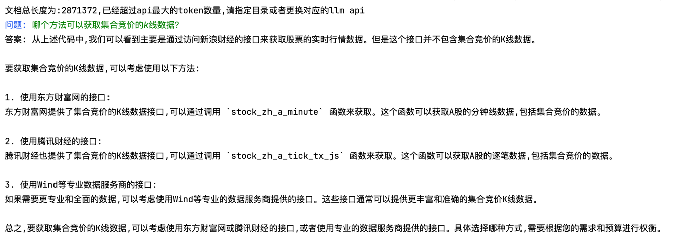

## 加群


# CodeChai 项目!

这个项目是为了更快速的阅读代码而生的。项目基于langchain实现，使用LongContent技术，而非任何RAG技术来实现LLM的问答

出发点是因为我个人需要阅读一些代码，但是发现自己去看些人写的文档又很累，我感觉大部分程序猿的代码能力很强，但是表达能力很弱，需要一个工具来磨平这个代沟，
所以我就写了这个工具给自己用。

基于这个工具可以做很多事情


## 项目概述

CodeChai 项目旨在辅助程序猿编写和快速理解代码内容，以及更快更方便的阅读代码。
由于其基于长文本(Long Content)实现，而非RAG技术，所以在某些大项目的代码阅读场景下存在一些局限性。

## Get Started

要使用 CodeChai 项目,请按照以下步骤操作:

1. 克隆存储库:

   ```
   git clone https://github.com/xsser_w/codechai.git
   ```

2. 导航到项目目录:

   ```
   cd codechai/github_codes/codechai
   ```
3. 安装依赖 ```pip install -r requirements.txt```


## 简化命令行操作

为简化命令行操作，可以在 Bash 环境中设置别名，减少每次输入的命令长度。在您的 `~/.bash_profile` 或 `~/.bashrc` 文件中添加以下别名设置:

1. 修改~/.bash_profile
```bash
alias codechai='./codechai --repo_path="./github_codes/langchain/" --llm_provider="anthropic" --relative_path="libs/core/langchain_core/document_loaders" --api_key="" --model="claude-3-haiku-20240307"'
```
2.  保存别名
```bash
source ~/.zshrc  # 或 source ~/.bash_profile
```
3. 使用
```bash
codechai --repo_path="./github_codes/langchain/"
```


## 使用方法

1. 运行 `codechai` 命令与基于 OpenAI 的文档加载器交互:

   ```
   ./codechai --repo_path="./github_codes/langchain/" --llm_provider="openai" --relative_path="libs/core/langchain_core/document_loaders" --api_key="" --model="google/gemini-pro-1.5" --openai_api_base='https://openrouter.ai/api/v1'
   ```

2. 运行 `codechai` 命令与基于 Anthropic 的文档加载器交互:

   ```
   ./codechai --repo_path="./github_codes/langchain/" --llm_provider="anthropic" --relative_path="libs/core/langchain_core/document_loaders" --api_key="" --model="claude-3-haiku-20240307"
   ```

请注意,您需要用实际的 GitHub 用户名和 OpenAI 及 Anthropic 的相应 API 密钥替换占位符(`your-username`, `sk-or-v1-...`, `sk-ant-api03-...`)。
### 注意！运行python版codechai代码你需要修改以下内容

修改langchain_community包下的 `/python3.11/site-packages/langchain_community/document_loaders/git.py`文件 将内容替换成项目下的`langchain_git_loader.py`文件


## 命令行参数

该项目使用以下命令行参数:

- `--repo_url`: Git 克隆远程下载的仓库。
- `--repo_path`: 本地目录。
- `--branch`: 分支。
- `--relative_path`: 指定加载目录(部分仓库代码太大,可能会导致超过 LLM API 加载 token 限制)。
- `--max_characters`: 指定最大的 LLM token 数量。
- `--llm_provider`: LLM 类型,可选 `anthropic` 或 `openai`。
- `--api_key`: API 密钥。
- `--model`: 模型名称。
- `--file_extensions`:加载需要解释的扩展名，比如py,java,ts,js
- `--temperature`: 模型的 temperature 参数。
- `--max_tokens`: 最大的单次 LLM API 请求参数,与 `max_characters` 有区别。
- `--openai_api_base`: OpenAI API 基础 URL,支持 OpenRoute 等自定义模型。

## 使用效果







## 一些经验
1. 语言模型最好是gemini pro 1.5（很大很大，忘记多大了）或者是claude的haiku(200k)，其他的模型支持的上下文不到128k，比如chatgpt-4-turbo 就只有128k，只能阅读一个很小的项目，所以你可以使用
``--relative_path``来指定一个相对较小的目录来实现代码的阅读，这也是导致现在的llm 应用层在卷RAG的原因
2. openrouter.ai  我非常建议大家使用这个网站的llm api
3. 使用google gemini pro 的时候注意api 费用，如果你要阅读的代码量很大的话，可能问1个问题需要3美元。我最多的时候花费了$5美元来问一个问题。

## 奇怪的用法
1. 用来挖漏洞，直接问ai，有啥漏洞。当然这样的方式有点蠢，只能挖到一些很容易看到的，你可以使用`--file_extensions`参数来指定你要问的扩展名
2. 用来阅读pdf， 也适用`--file_extensions`
3. 用来阅读htlm文档，没错 请你wget爬官方html文档来进行问答

## 未来规划
1. 支持api化
2. 支持更友好的bash命令行
3. 支持python agent等，直接让llm 根据文档写代码，写完代码直接在环境运行

## 贡献

欢迎为 CodeChai LangChain 项目做出贡献。如果您想贡献,请遵循标准的 GitHub 工作流程:

1. Fork 该存储库
2. 为您的功能或错误修复创建一个新分支
3. 提交您的更改
4. 将您的分支推送到您的 Fork 存储库
5. 提交拉取请求

我们感谢您的贡献,以帮助改进和扩展 CodeChai 项目的功能。

## 许可证

该项目基于 [MIT 许可证](LICENSE)进行许可。

